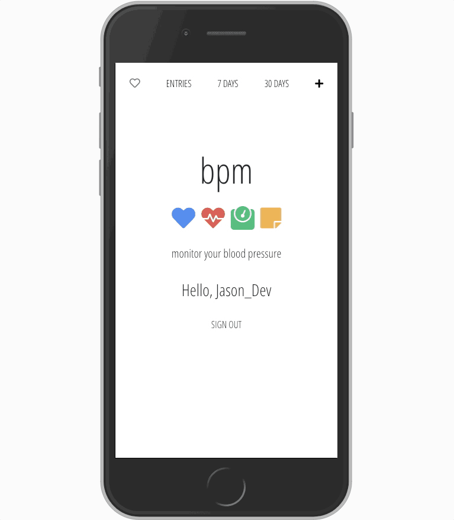

# bpm

//  goes here...

## bpm is a React app with Firebase utilities designed to help you monitor your blood pressure by logging systolic and diastolic numbers, pulse, weight and any additional notes you might want to add. You can also view entries from the last 7 or 30 days including an average blood pressure calculation for each term.

## Technologies Used:
- React
- Firebase Authentication
- Cloud Firestore Database
- MomentJS
- Motion
- Reactstrap
- Bootstrap

## bpm is hosted via Firebase hosting... 
Visit...
User: Guest
Password: GuestPassword

## Thanks for checking out bpm!